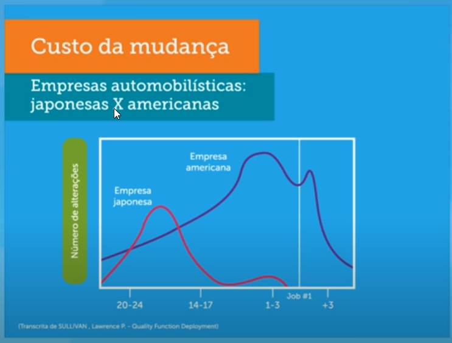

```{r setup, include=TRUE, echo=FALSE}
options(htmltools.dir.version = FALSE)
```

class: center, middle

# Retrospecto

---

class: inverse, center, middle

# QFD em inovação!!!!

---

# QFD

#### Objetivo: traduzir para termos técnicos a demanda do cliente
QFD é uma ferramenta de tradução da voz do cliente em expressões técnicas para engenharia desenvolver processos

.pull-left[
### Empresa tradicional
- Entregar o que o cliente precisa   
- Empresa define o que deve ser feito   
- 80% satisfação  
]

.pull-right[
### QFD
- pesquisa de mercado   
- desdobramento em departamentos   
- 90/95% de satisfação   
]

---

```{r, out.width = "100%", fig.align="center", echo=FALSE, fig.cap=""}
knitr::include_graphics("img/1.png")
```

---

```{r, out.width = "100%", fig.align="center", echo=FALSE, fig.cap=""}

```

---

# A casa da qualidade - House of Quality

Esquerdo - voz do cliente   
Superior - tradução - especificações técnicas   
Direita - avaliação competitiva - benchmarking   
Inferior - Quanto - para cada especificação do projeto  

```{r, out.width = "70%", fig.align="center", echo=FALSE, fig.cap=""}
knitr::include_graphics("img/24.png")
```

---

# Matrizes

```{r, out.width = "100%", fig.align="center", echo=FALSE, fig.cap=""}
knitr::include_graphics("img/19.png")
```

1. Matriz do planejamento do produto - características e desdobramentos   
2. Matriz de componentes críticos para execução   
3. Planejamento dos processos, relacionando-os às características principais dos produtos e dos componentes   
4. Planejamento da fabricação - parâmetros para controle de produtos e processos.    


---

# Estrutura de desdobramento da função da qualidade nas 4 matrizes

Para cada matriz, existe o envolvimento de novas áreas da organização
1. Clientes, marketing e vendas  
2. Produto   
3. Engenharia de processo   
4. Engenharia de manufatura   

#### Olhar sistêmico e alinhamento de diversas áreas das organizações, antecipando problemas na produção ou nas mãos dos clientes

---
class: inverse, center, middle

# As 4 casas da qualidade do QFD permitem integração entre clientes, P&D&I, desenvolvimento de produto e manufatura.


---

# Conceitos gerais...

- Escala Likert na avaliação competitiva   
- Dificuldades organizacionais: limitações e processos sem investimento em capacidade      
- Correlação: relações entre as expressões técnicas   
- Avaliação competitiva: comparação com concorrentes   
- Importância absoluta e relativa: grau de importância.   

---
# Exemplo: cliente no supermercado

Matriz 1 - Planejamento: Desejos e necessidades dos clientes

Matriz 2 - Componentes: corredores, setores e gôndolas

Matriz 3 - Planejamento de processo: abastecimento, manuseio de mercadorias

Matriz 4 - Planejamento da produção: detalhar fluxo de processos e observar o que controlar em relação ao processo (parâmetros) e produtos (características) gerenciamento por processos. 

---
class: inverse, center, middle

# Dúvidas?
